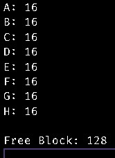

# Binary Buddy Memory Management

**Must have g++ compiler and make**


To run the application follow the given steps:

0. Run the following to remove junk files:
```
make clean
```

1. Run `make` command in root directory to build the executable:
```
make
```

2. Use the following command to execute bash script and get output file:
```
bash runme <input_file_path> <output_file_path>
```

**Note:** Sample inputs and outputs are given their respective folders

## OUTPUT1.txt
 <br>

## OUTPUT2.txt
 <br>

## OUTPUT3.txt
 <br>

## OUTPUT4.txt
 <br>

## OUTPUT5.txt
 <br>

